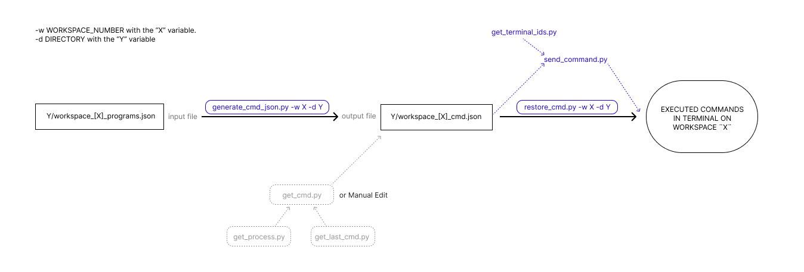

# i3-resurrect-cmd

An extension for i3-resurrect (https://github.com/JonnyHaystack/i3-resurrect) that adds functionality for setting and restoring terminal commands.

## TODO

- [ ] Fix the `main.py` so that `./restore_cmd.py` only executes after the workspace resurrection is successfully completed.
- [ ] Find a way to append command strings to the `cmd.json`, e.g., `./append_cmd.py -w X -d Y -index Z <command string>`
- [ ] `get_last_command.py`
- [ ] `get_process.py`
- [ ] `get_command.py` = [ ./get_last_command.py && ./get_process.py ]  
- [ ] `./save_cmd.py` = [ gen_cmd.py >> get_cmd.py ]

## Installation

1. Ensure i3-resurrect is installed on your system.
2. Clone this repository.
3. Navigate to the repository directory.
4. Run `pip install -e .`

## Usage

- To save a workspace and generate a <directory>/workspace_<workspace_number>_cmd_JSON where the commands can be set for each terminal:
  ```
  i3-resurrect-cmd save -w <workspace_number> -d <directory>
  ```

- To restore a workspace and send commands to terminals:
  ```
  i3-resurrect-cmd restore -w <workspace_number> -d <directory>
  ```

Replace <workspace_number> with the number of the workspace you want to save/restore, and <directory> with the path where you want to save/restore the files.

## Development

This project uses a Nix shell for development. To enter the development environment:

1. Ensure you have Nix installed.
2. Run `nix-shell` in the project directory.

This will set up all necessary dependencies and create a Python virtual environment.

The next diagram shows the current process, and in soft gray at the bottom the intended addition.


